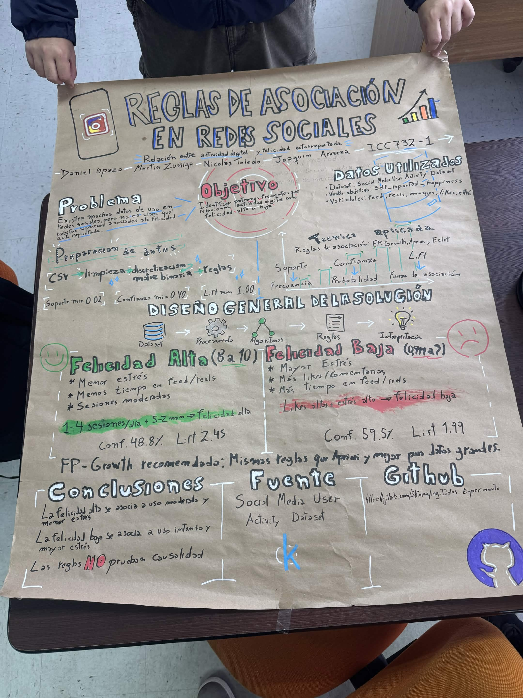

# Analisis de actividad en redes sociales y felicidad autorreportada

Proyecto de Ingenieria de Datos orientado a descubrir patrones frecuentes entre habitos de uso de redes sociales, variables de estilo de vida y niveles de felicidad autorreportada mediante reglas de asociacion.

## Integrantes

- Martin Zuniga
- Daniel Opazo
- Joaquin Arabena
- Nicolas Toledo

## Resumen del proyecto

El proyecto analiza el dataset **Social Media User Activity Dataset** para responder la siguiente pregunta:

> Que combinaciones de habitos de uso e interaccion en redes sociales se asocian frecuentemente con niveles altos, medios o bajos de `self_reported_happiness`?

Para responderla, se construyo un flujo de preparacion de datos y mineria de patrones frecuentes. El experimento compara tres algoritmos de reglas de asociacion: **Apriori**, **FP-Growth** y **Eclat**. La calidad de las reglas se evalua usando soporte, confianza y lift.

## Problema abordado

El uso de redes sociales genera grandes volumenes de datos sobre frecuencia de uso, interacciones, tiempo dentro de la aplicacion y preferencias de contenido. Sin embargo, no siempre es evidente como estas variables aparecen combinadas junto con distintos niveles de bienestar percibido.

El problema abordado consiste en identificar patrones frecuentes que relacionen actividad digital y estilo de vida con la variable `self_reported_happiness`. El objetivo no es predecir causalidad, sino encontrar asociaciones interpretables que ayuden a describir perfiles de usuarios.

## Objetivo

Identificar reglas de asociacion interpretables que relacionen variables de actividad en redes sociales, interaccion digital y estilo de vida con niveles de felicidad autorreportada.

Los objetivos especificos son:

- Preparar el dataset para mineria de reglas de asociacion.
- Transformar variables numericas en intervalos interpretables mediante cuantiles.
- Construir una matriz binaria compatible con algoritmos de patrones frecuentes.
- Ejecutar y comparar Apriori, FP-Growth y Eclat.
- Seleccionar el algoritmo mas conveniente segun la cantidad y calidad de reglas relacionadas con felicidad.
- Interpretar los principales patrones encontrados sin afirmar causalidad.

## Dataset utilizado

- **Nombre:** Social Media User Activity Dataset
- **Fuente:** Kaggle
- **URL:** https://www.kaggle.com/datasets/sadiajavedd/social-media-user-activity-dataset
- **Archivo esperado:** `instagram_usage_lifestyle.csv`
- **Volumen documentado:** aproximadamente 1,500,000 registros y mas de 50 columnas.

El dataset contiene informacion sobre demografia, estilo de vida, habitos de salud, uso de redes sociales, interacciones digitales, tiempo dentro de la app y preferencias de contenido.

Variables relevantes usadas en el analisis:

- Demograficas: `age`, `gender`, `country`, `urban_rural`, `income_level`, `employment_status`, `education_level`, `relationship_status`, `has_children`.
- Estilo de vida y salud: `exercise_hours_per_week`, `sleep_hours_per_night`, `diet_quality`, `smoking`, `perceived_stress_score`, `self_reported_happiness`, `body_mass_index`, `daily_steps_count`, `weekly_work_hours`.
- Actividad digital: `sessions_per_day`, `average_session_length_minutes`, `posts_created_per_week`, `likes_given_per_day`, `comments_written_per_day`, `dms_sent_per_week`, `followers_count`, `following_count`.
- Tiempo en la aplicacion: `time_on_feed_per_day`, `time_on_explore_per_day`, `time_on_messages_per_day`, `time_on_reels_per_day`.
- Preferencias: `content_type_preference`, `preferred_content_theme`, `privacy_setting_level`.

El archivo CSV no se incluye en el repositorio porque esta ignorado por Git para evitar versionar archivos pesados. Debe descargarse desde Kaggle y colocarse localmente en la raiz del proyecto.

## Tecnica aplicada

Se aplicaron **reglas de asociacion**, una tecnica de mineria de datos que permite encontrar combinaciones de atributos que aparecen juntas con frecuencia.

Las reglas se evaluaron con tres metricas:

- **Soporte:** proporcion de registros donde aparece la combinacion completa.
- **Confianza:** proporcion de casos donde aparece el consecuente cuando aparece el antecedente.
- **Lift:** fuerza de asociacion frente a lo esperado por azar. Un lift mayor que 1 indica asociacion positiva.

Algoritmos comparados:

- **Apriori:** algoritmo clasico basado en generacion de itemsets frecuentes.
- **FP-Growth:** algoritmo eficiente para descubrir itemsets frecuentes usando una estructura FP-Tree.
- **Eclat:** algoritmo basado en representacion vertical de transacciones.

## Diseno general de la solucion

El flujo del proyecto es el siguiente:

1. Carga del dataset local.
2. Normalizacion de nombres de columnas.
3. Analisis de cardinalidad y eliminacion de columnas no adecuadas.
4. Seleccion de columnas relevantes para el analisis.
5. Limpieza de valores faltantes.
6. Normalizacion de categorias de texto.
7. Muestreo de trabajo para controlar tiempo y memoria.
8. Agrupacion de categorias raras.
9. Discretizacion de variables numericas mediante cuantiles.
10. Creacion de matriz binaria sparse.
11. Filtrado de items con soporte menor al umbral definido.
12. Ejecucion de Apriori, FP-Growth y Eclat.
13. Generacion de reglas de asociacion.
14. Filtrado de reglas relacionadas con `self_reported_happiness`.
15. Comparacion de algoritmos y analisis de resultados.

El codigo reutilizable del pipeline esta en:

```text
src/social_media_activity_pipeline.py
```

El experimento principal esta documentado y ejecutado en:

```text
notebooks/social_media_activity_colab.ipynb
```

## Preparacion y transformacion de datos

Las transformaciones principales fueron:

- Normalizacion de nombres de columnas a formato estable tipo `snake_case`.
- Normalizacion de categorias de texto para evitar duplicados por mayusculas, espacios o caracteres especiales.
- Limpieza de valores faltantes con estrategias diferenciadas para variables numericas y categoricas.
- Seleccion de columnas utiles para reglas de asociacion.
- Reduccion de categorias poco frecuentes para controlar el ancho de la matriz binaria.
- Discretizacion de variables numericas por cuantiles, con un maximo de 5 intervalos en la configuracion final.
- Codificacion one-hot de las variables discretizadas y categoricas.
- Uso de matriz sparse para reducir consumo de memoria.

La variable de interes principal es:

```text
self_reported_happiness
```

## Configuracion del experimento

La ejecucion documentada uso la siguiente configuracion principal:

| Parametro | Valor |
|---|---:|
| Muestra para FP-Growth y Apriori | 100,000 filas |
| Muestra para Eclat | 20,000 filas |
| `MAX_BINS` | 5 |
| `MIN_SUPPORT` | 0.02 |
| `MIN_CONFIDENCE` | 0.40 |
| `MIN_LIFT` | 1.00 |
| `MAX_ITEMSET_LENGTH` | 3 |
| `ECLAT_MAX_COMBINATION` | 2 |

Eclat se ejecuto con una muestra menor porque `pyECLAT` transforma la matriz binaria en transacciones de texto, lo que aumenta considerablemente el consumo de memoria.

## Resultados principales

Comparacion de algoritmos obtenida en la ejecucion local documentada:

| Algoritmo | Itemsets frecuentes | Reglas totales | Reglas con felicidad | Soporte promedio | Confianza promedio | Lift promedio | Lift maximo |
|---|---:|---:|---:|---:|---:|---:|---:|
| FP-Growth | 57,676 | 41,550 | 2,427 | 0.0344 | 0.5874 | 1.7680 | 4.6390 |
| Apriori | 57,676 | 41,550 | 2,427 | 0.0344 | 0.5874 | 1.7680 | 4.6390 |
| Eclat | 10,371 | 849 | 26 | 0.0989 | 0.5111 | 1.2349 | 1.6964 |

FP-Growth y Apriori obtuvieron los mismos resultados bajo la configuracion utilizada. FP-Growth se considera la alternativa mas conveniente para continuar el analisis porque entrega los mismos patrones que Apriori y suele ser mas eficiente para datasets grandes.

### Perfil asociado con felicidad alta

Las reglas asociadas a `self_reported_happiness__8_to_10` muestran un patron de uso mas moderado y menor estres percibido.

Ejemplos de reglas destacadas:

| Antecedente | Consecuente | Soporte | Confianza | Lift |
|---|---|---:|---:|---:|
| `average_session_length_minutes__5_to_12` AND `sessions_per_day__0.999_to_4` | `self_reported_happiness__8_to_10` | 0.0345 | 0.4875 | 2.4530 |
| `perceived_stress_score__8_to_16` AND `time_on_feed_per_day__2_to_41` | `self_reported_happiness__8_to_10` | 0.0244 | 0.4653 | 2.3414 |
| `likes_given_per_day__11_to_66` AND `perceived_stress_score__8_to_16` | `self_reported_happiness__8_to_10` | 0.0242 | 0.4597 | 2.3133 |

Interpretacion: la felicidad alta tenia una frecuencia base aproximada de 19.87%, pero en estos subgrupos aparece cerca de 45% a 49%. Esto indica una asociacion relevante entre uso moderado, menor estres y felicidad alta.

### Perfil asociado con felicidad baja

Las reglas asociadas a `self_reported_happiness__0.999_to_3` muestran un patron de mayor estres, mayor interaccion y mayor tiempo de uso.

Ejemplos de reglas destacadas:

| Antecedente | Consecuente | Soporte | Confianza | Lift |
|---|---|---:|---:|---:|
| `likes_given_per_day__171_to_317` AND `perceived_stress_score__24_to_32` | `self_reported_happiness__0.999_to_3` | 0.0338 | 0.5946 | 1.9862 |
| `perceived_stress_score__24_to_32` AND `time_on_feed_per_day__145_to_321` | `self_reported_happiness__0.999_to_3` | 0.0337 | 0.5743 | 1.9185 |
| `comments_written_per_day__50_to_80` AND `dms_sent_per_week__40_to_80` | `self_reported_happiness__0.999_to_3` | 0.0664 | 0.5471 | 1.8276 |

Interpretacion: la felicidad baja tenia una frecuencia base aproximada de 29.94%, pero en estos subgrupos aparece cerca de 54% a 59%. Esto refuerza la asociacion entre alto estres, alta interaccion digital y felicidad baja.

## Conclusiones

- El proyecto logro obtener reglas de asociacion interpretables entre habitos de uso de redes sociales y niveles de felicidad autorreportada.
- FP-Growth fue seleccionado como algoritmo recomendado porque obtuvo los mismos resultados que Apriori y es mas adecuado para escalar a datasets grandes.
- La felicidad alta se asocio con menor estres y uso mas moderado de la aplicacion.
- La felicidad baja se asocio con mayor estres, mayor tiempo de uso y mayor volumen de interacciones.
- Las variables mas recurrentes en las reglas relevantes fueron `perceived_stress_score`, `likes_given_per_day`, `time_on_feed_per_day`, `comments_written_per_day`, `dms_sent_per_week`, `time_on_messages_per_day` y `time_on_reels_per_day`.
- Los resultados deben interpretarse como asociaciones frecuentes, no como relaciones causales.

## Reproducibilidad

Repositorio del proyecto:

```text
https://github.com/Shtolaa/ing_Datos_Experimento
```

### Opcion A: Ejecutar en Google Colab

Esta es la forma recomendada para probar el experimento sin configurar un entorno local.

#### 1. Abrir el notebook en Colab

Entrar a Google Colab:

```text
https://colab.research.google.com/
```

Seleccionar la opcion para abrir un notebook desde GitHub y usar el repositorio:

```text
https://github.com/Shtolaa/ing_Datos_Experimento
```

Luego abrir el archivo:

```text
notebooks/social_media_activity_colab.ipynb
```

Tambien se puede abrir el notebook desde GitHub y elegir la opcion de abrirlo en Colab si el navegador la muestra.

#### 2. Preparar el dataset

El dataset se descarga desde Kaggle:

```text
https://www.kaggle.com/datasets/sadiajavedd/social-media-user-activity-dataset
```

En Colab hay dos formas de usarlo:

- Subir manualmente `archive.zip` o `instagram_usage_lifestyle.csv` al entorno de Colab cuando el notebook lo solicite.
- Configurar credenciales de Kaggle para que el notebook pueda descargar el dataset automaticamente.

Si se usa Kaggle automaticamente, se necesita un archivo `kaggle.json` generado desde la cuenta de Kaggle. En Colab, subir ese archivo cuando corresponda o dejarlo disponible en el entorno antes de ejecutar la celda de descarga.

#### 3. Ejecutar el experimento

En Colab, ejecutar todas las celdas del notebook en orden:

```text
Runtime > Run all
```

El notebook instala las dependencias necesarias, carga el dataset, prepara los datos, ejecuta los algoritmos y genera los resultados.

#### 4. Revisar resultados en Colab

La ejecucion genera archivos en:

```text
outputs/
```

Archivos esperados:

- `algorithm_comparison.csv`
- `apriori_itemsets.csv`
- `apriori_rules.csv`
- `apriori_happiness_rules.csv`
- `fp_growth_itemsets.csv`
- `fp_growth_rules.csv`
- `fp_growth_happiness_rules.csv`
- `eclat_itemsets.csv`
- `eclat_rules.csv`
- `eclat_happiness_rules.csv`

Estos archivos quedan dentro del entorno temporal de Colab. Si se quieren conservar, deben descargarse antes de cerrar la sesion.

### Opcion B: Ejecutar en local con Windows PowerShell

#### 1. Clonar el repositorio

```powershell
git clone https://github.com/Shtolaa/ing_Datos_Experimento.git
cd ing_Datos_Experimento
```

Si ya se esta trabajando dentro del repositorio, solo ubicarse en la raiz del proyecto.

#### 2. Crear y activar entorno virtual

En Windows PowerShell:

```powershell
python -m venv .venv
.\.venv\Scripts\Activate.ps1
```

Si PowerShell bloquea la activacion del entorno, ejecutar en la misma terminal:

```powershell
Set-ExecutionPolicy -Scope Process -ExecutionPolicy Bypass
.\.venv\Scripts\Activate.ps1
```

#### 3. Instalar dependencias

```powershell
pip install --upgrade pip
pip install -r requirements.txt
```

#### 4. Descargar el dataset

Descargar el dataset desde Kaggle:

```text
https://www.kaggle.com/datasets/sadiajavedd/social-media-user-activity-dataset
```

Luego colocar uno de estos archivos en la raiz del proyecto:

```text
instagram_usage_lifestyle.csv
```

o bien:

```text
archive.zip
```

Ambos nombres estan ignorados por Git, por lo que no apareceran como cambios pendientes del repositorio.

#### 5. Ejecutar el notebook

Iniciar Jupyter:

```powershell
jupyter notebook
```

Abrir y ejecutar todas las celdas de:

```text
notebooks/social_media_activity_colab.ipynb
```

#### 6. Archivos generados

La ejecucion genera resultados en la carpeta local:

```text
outputs/
```

Archivos esperados:

- `algorithm_comparison.csv`
- `apriori_itemsets.csv`
- `apriori_rules.csv`
- `apriori_happiness_rules.csv`
- `fp_growth_itemsets.csv`
- `fp_growth_rules.csv`
- `fp_growth_happiness_rules.csv`
- `eclat_itemsets.csv`
- `eclat_rules.csv`
- `eclat_happiness_rules.csv`

La carpeta `outputs/` esta ignorada por Git porque puede contener archivos pesados generados automaticamente.

## Estructura del repositorio

```text
.
├── README.md
├── requirements.txt
├── src/
│   └── social_media_activity_pipeline.py
├── notebooks/
│   └── social_media_activity_colab.ipynb
└── docs/
    ├── Proyecto Parte 1.md
    └── informe_resultados_reglas_asociacion.md
```

Archivos locales esperados, no versionados:

```text
instagram_usage_lifestyle.csv
archive.zip
outputs/
data/
```

## Documentacion adicional

- Definicion inicial del problema, dataset y EDA: `docs/Proyecto Parte 1.md`
- Informe detallado de resultados: `docs/informe_resultados_reglas_asociacion.md`
- Funciones reutilizables del pipeline: `src/social_media_activity_pipeline.py`
- Notebook principal del experimento: `notebooks/social_media_activity_colab.ipynb`

## Poster del proyecto

La entrega P2+P3 requiere incluir una fotografia clara del poster fisico final hecho a mano sobre papel craft.

Cuando la fotografia este disponible, agregarla al repositorio en la siguiente ruta:

```text
docs/poster_final.jpg
```

Luego se puede visualizar desde esta seccion con la siguiente referencia:

```markdown

```

Contenido minimo que debe aparecer en el poster:

- Titulo del proyecto e integrantes.
- Problema abordado.
- Objetivo del proyecto.
- Datos utilizados.
- Preparacion o transformacion de los datos.
- Tecnica aplicada.
- Diseno general de la solucion.
- Resultados principales.
- Conclusiones.
- Referencia al repositorio de GitHub.

## Limitaciones

- Las reglas de asociacion no demuestran causalidad. Solo indican que ciertos patrones aparecen juntos con mayor frecuencia que la esperada.
- La discretizacion por cuantiles facilita aplicar reglas de asociacion, pero la interpretacion depende de los intervalos generados.
- Eclat se ejecuto con una muestra menor por restricciones de memoria, por lo que sus resultados se consideran complementarios.
- El dataset es de uso academico y debe interpretarse dentro del contexto de las variables disponibles.

## Cumplimiento de la entrega

Este repositorio incluye el material necesario para revisar la implementacion del proyecto:

- Codigo fuente del pipeline.
- Notebook reproducible.
- Dependencias del entorno.
- Documentacion del problema y resultados.
- Instrucciones para descargar el dataset y replicar el experimento.
- Seccion reservada para agregar la fotografia del poster final.
